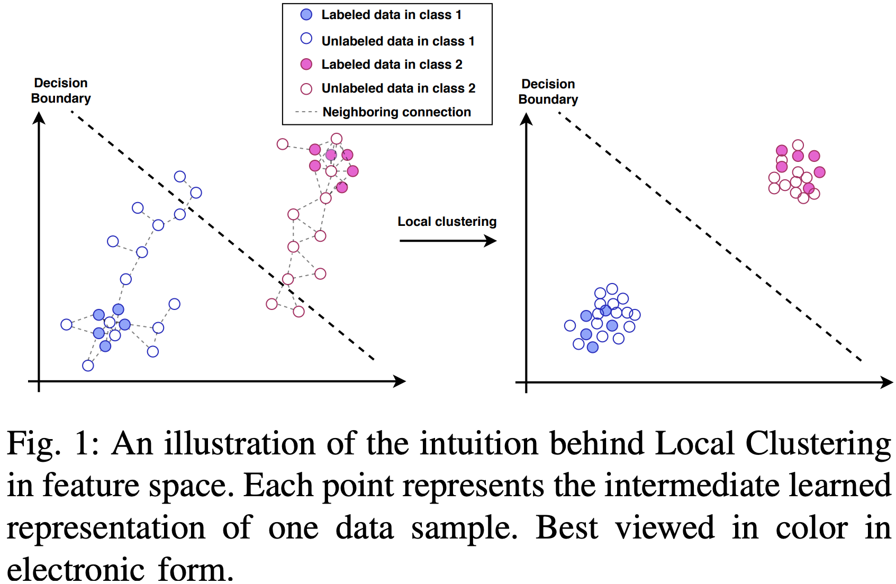
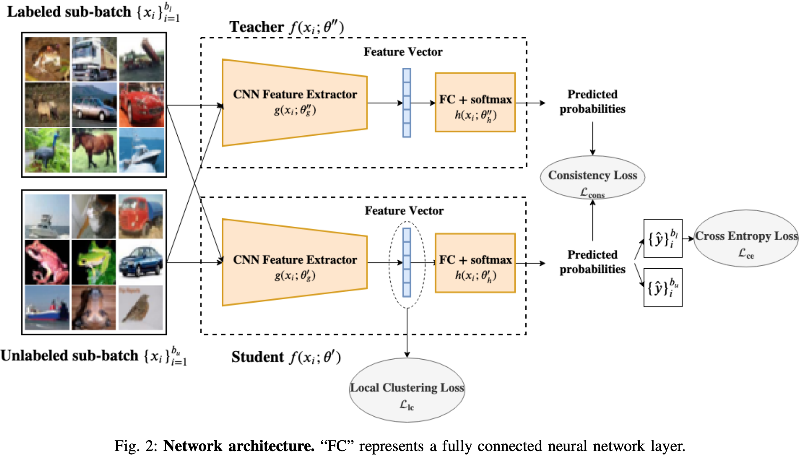

# Local Clustering with Mean Teacher for Semi-supervised learning

This repository contains pytorch code for the paper Local Clustering with Mean Teacher for Semi-supervised learning ([paper link](https://arxiv.org/pdf/2004.09665.pdf)).

In this paper, we propose a local clustering method to address the confirmation bias existing in Mean Teacher method. Motivated by widely used local consistency assumption in SSL, where nearby samples are likely to have the same label, we consider the vicinity of each unlabeled data sample in feature space and enhance the connections between neighboring samples. We propose the regularizer loss term that eventually pulls unlabeled data samples towards high-density regions with the assistance of neighboring samples. This is done by penalizing the distance between neighboring samples' feature representations. The intuition is that the weight updates thence caused would affect the learned features to help the model pick up on new cues from those unlabeled data samples, hopefully in the form of class-specific discriminative features. This intuition is illustrated in Figure 1.

<p align="center">
    
</p>

The network architecture is shown in Figure 2, where the local clustering regularizer is performed at the intermediate layer of the network.

<p align="center">
    
</p>

### Requirements
The code has been tested with
python 3.5.2  
pytorch 1.1.0  
CUDA 9.0  

### For reproducing results on CIFAR-10 with 4,000 labeled samples using our method, set model_training.dataset = 'cifar10' and set a unique number to model_training.model_id in config.py, and run the command
```
python3 train_mean_teacher_local_clustering.py
```

### For reproducing results on SVHN with 1,000 labeled samples using our method, set model_training.dataset = 'svhn' and set a unique number to model_training.model_id in config.py, and run the command
```
python3 train_mean_teacher_local_clustering.py
```

### Training configuration
All the hyper-parameter settings are in config.py file. You can change the hyper-parameters there for your own training purpose.
